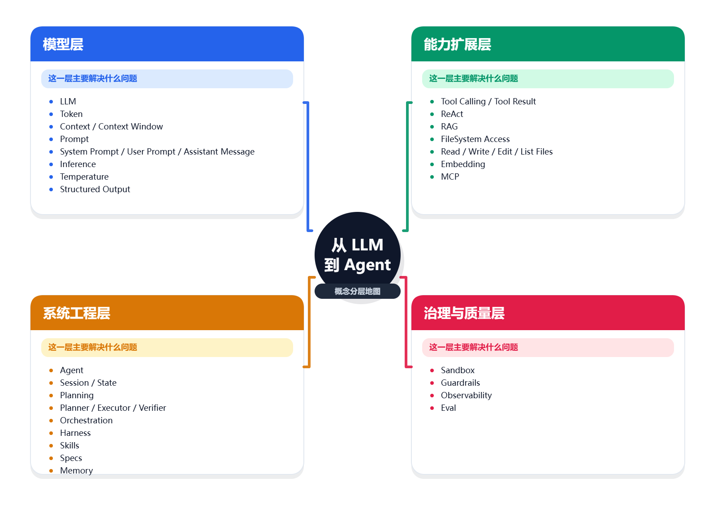
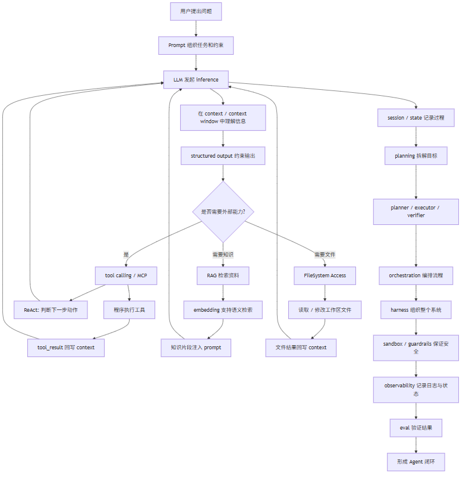

import WordPressHtml from '@/components/blog/WordPressHtml.astro'

<WordPressHtml html={String.raw`<h1>当我们聊 Agent 时，我们到底在说什么？</h1>
<blockquote>

从 <code>LLM</code>、<code>token</code>、<code>prompt</code> 到 <code>RAG</code>、<code>tool calling</code>、<code>ReAct</code>、<code>memory</code>、<code>orchestration</code>，为初学者画一张从模型到 Agent 系统的概念地图。

</blockquote>

刚开始接触 AI 时，最让人头疼的往往不是代码，而是术语。

<code>LLM</code>、<code>token</code>、<code>context window</code>、<code>temperature</code>、<code>tool calling</code>、<code>ReAct</code>、<code>RAG</code>、<code>FileSystem Access</code>、<code>embedding</code>、<code>eval</code>、<code>Agent</code>、<code>prompt</code>、<code>harness</code>、<code>skills</code>、<code>MCP</code>、<code>specs</code>、<code>memory</code>，再加上后面很快会碰到的 <code>inference</code>、<code>structured output</code>、<code>session</code>、<code>state</code>、<code>orchestration</code>、<code>sandbox</code>、<code>guardrails</code>、<code>observability</code>，这些词会在你眼前同时冒出来。

它们看起来都很重要，也确实都很重要。问题在于，如果脑子里还没有一张清晰的地图，这些词就会像散落在桌面上的零件一样：每个都认识一点，但始终拼不成一个完整系统。

这篇文章想做的，就是把这些概念重新整理成一张适合初学者的地图。它不追求教科书式定义最严谨，而追求一件更实用的事：当初学者后面继续学习或者拆解各种 Agent 工程项目时，能始终知道自己正在看哪一层、这个概念到底在解决什么问题。

<h2>为什么一开始不要急着“做 Agent”</h2>

很多人刚接触 AI 时，都会自然地冒出一个想法：我能不能直接做一个 Agent？

这个冲动没有错，但它很容易让人跳过一个关键阶段：先把概念分层。

因为在今天的 AI 工程里，很多词虽然经常被一起提到，但它们其实不在同一个层面上：

<ul>
<li>有的属于模型本身</li>
<li>有的属于能力扩展</li>
<li>有的属于系统工程</li>
<li>有的属于安全治理和质量保障</li>
</ul>

如果不先把这些层次拆开，我们就很容易陷入一种典型困境：教程看了不少，术语也见过很多，但一旦真的动手，脑子里仍然是一团模糊的“AI 黑箱”。

所以这篇文章的核心，不是背定义，而是建立一套可复用的理解框架。

<h2>第一层：模型层</h2>

先从最底层开始。很多概念最后都能追溯到模型层，也就是“模型到底在做什么、怎么做”。

<h3>LLM 是什么</h3>

<code>LLM</code> 是 <code>Large Language Model</code> 的缩写，中文通常叫“大语言模型”。

最朴素的理解方式是：它是一个在海量文本上训练出来的通用语言系统，能够根据上下文生成接下来最合适的内容。今天常见的 Claude、GPT、Qwen、DeepSeek、Kimi、豆包等，都属于这个范畴。

它之所以重要，是因为它提供了整个 AI 应用的核心能力：

<ul>
<li>理解自然语言</li>
<li>生成自然语言</li>
<li>解释和编写代码</li>
<li>在一定上下文中做推理和规划</li>
</ul>

从工程角度看，<code>LLM</code> 解决的是“让机器具备通用语言理解与生成能力”这个问题。它不是完整应用，也不是完整 Agent，但它是一切后续能力的引擎。

<h3>token 是什么</h3>

<code>token</code> 可以理解成模型处理文本时的基本计量单位。它不完全等于“字”，也不完全等于“词”，更像是模型内部切分文本后的片段。

它之所以重要，是因为几乎所有实际问题最后都会落到 token 上：

<ul>
<li>成本和计费</li>
<li>上下文容量</li>
<li>响应速度</li>
<li>日志和监控</li>
</ul>

很多时候，当我们说“这个 prompt 太长了”，本质上是在说：它占用了太多 token。

<h3>context 和 context window 是什么</h3>

<code>context</code> 是模型当前能看到的全部上下文内容。它不只是用户这一轮的问题，通常还包括：

<ul>
<li><code>system prompt</code></li>
<li>历史对话</li>
<li>工具执行结果</li>
<li>检索回来的知识片段</li>
<li>当前任务状态</li>
</ul>

<code>context window</code> 则是模型一次最多能处理多少上下文的上限，也就是“上下文窗口”。

这个概念特别关键，因为很多 Agent 系统的问题，最后根本不是“模型不够聪明”，而是“上下文管理不够好”。当上下文太长时，系统就必须做取舍：

<ul>
<li>删掉什么</li>
<li>总结什么</li>
<li>保留什么</li>
<li>延迟加载什么</li>
</ul>

换句话说，<code>context window</code> 回答的是“模型一次最多能看多少”，而上下文管理回答的是“在这有限空间里，什么最值得看”。

<h3>temperature 是什么</h3>

<code>temperature</code> 可以粗略理解为模型输出的发散程度，或者说随机性。

<ul>
<li>温度低：更稳定、更保守、更可预测</li>
<li>温度高：更发散、变化更多、也更容易跑偏</li>
</ul>

所以它解决的不是“让模型更聪明”，而是“控制模型输出风格和稳定性”。

如果是写代码、抽取结构化字段、生成配置，通常更偏向低温度；如果是脑暴、文案、创意探索，则可以适度提高。

<h3>prompt 是什么</h3>

很多人把 <code>prompt</code> 理解成“给 AI 提的问题”，这个理解不算错，但远远不够。

在工程里，prompt 更像一份任务说明书。它往往包含：

<ul>
<li>角色设定</li>
<li>任务目标</li>
<li>上下文资料</li>
<li>约束条件</li>
<li>输出格式</li>
</ul>

一个好的 prompt，不是更会说话，而是更会界定边界。它解决的是：<strong>如何让模型理解我到底要它做什么。</strong>

<h3>inference 是什么</h3>

<code>inference</code> 通常翻译为“推理”或“推断”，指的是模型真正处理一次请求并生成结果的过程。

你把 prompt 发给模型，模型开始返回内容，这整个过程就是一次 inference。

这个词在工程里很常见，因为它直接关联到：

<ul>
<li>延迟</li>
<li>成本</li>
<li>并发能力</li>
<li>输出稳定性</li>
</ul>

所以从产品和系统角度看，inference 不是抽象名词，而是“模型真正开始工作时到底发生了什么”。

<pre><code class="language-text">单次 inference 的最小链路

用户输入
   -&gt;
prompt 组装
   -&gt;
模型开始 inference
   -&gt;
生成输出 token
   -&gt;
返回结果给用户或程序</code></pre>
<h3>system prompt、user prompt 和 assistant message</h3>

真正写代码之后，我很快发现：只理解 <code>prompt</code> 还不够，还得理解消息在系统里是怎么组织的。

常见的几类消息包括：

<ul>
<li><code>system prompt</code>：系统级规则，定义角色、边界和风格</li>
<li><code>user prompt</code>：用户这一轮的真实问题或任务</li>
<li><code>assistant message</code>：模型已经给出的回复</li>
<li><code>tool_result</code>：工具执行之后返回的结果</li>
</ul>

这些东西会一起组成模型眼中的 <code>context</code>。也就是说，模型很多时候并不是只在看“你这一轮说了什么”，而是在同时看：

<ul>
<li>系统让它成为什么样的角色</li>
<li>它前面已经说过什么</li>
<li>工具刚刚做了什么</li>
<li>当前任务推进到了哪里</li>
</ul>

这也是为什么只做聊天接口和真正做 Agent，复杂度会差这么多。

<h3>structured output 是什么</h3>

<code>structured output</code> 指的是让模型按照固定结构输出内容，比如 JSON、字段表、特定 schema。

例如，不是让模型自由发挥地回答：

<pre><code class="language-text">帮我分析这个报错</code></pre>

而是要求它输出：

<pre><code class="language-json">{
  "root_cause": "",
  "severity": "",
  "next_action": []
}</code></pre>

它之所以重要，是因为自然语言适合给人看，结构化输出更适合给程序消费。很多 Agent 系统之所以能继续自动往下执行，很大程度上就是因为前一步输出足够结构化，后一步才能稳定接住。

<h2>第二层：能力扩展层</h2>

只有模型本身，我们最多能做一个“会聊天的系统”。但想做真正有用的 AI 应用，就必须让模型接触真实世界、接触外部知识、接触工具和服务。

<h3>tool calling 是什么</h3>

<code>tool calling</code> 是让模型在需要时主动调用外部工具的机制。

比如模型自己并不知道当前时间、不能直接读本地文件，也不能真的去执行 Shell 命令。但如果你给它注册了工具：

<ul>
<li><code>get_time</code></li>
<li><code>read_file</code></li>
<li><code>run_bash</code></li>
</ul>

那么模型就可以在推理过程中决定：“这个问题我需要先调用某个工具，再根据结果继续回答。”

这里有一个非常重要的职责分工：

<ul>
<li>决定要不要调用工具的是模型</li>
<li>真正执行工具的是你的程序</li>
<li>把工具结果再喂回模型的，还是你的程序</li>
</ul>

这一步意味着系统从“只会说”进化到了“能行动”。

<pre><code class="language-text">tool calling 的最小闭环

用户问题
   -&gt;
LLM 判断是否需要工具
   -&gt;
输出 tool call
   -&gt;
程序执行工具
   -&gt;
得到 tool_result
   -&gt;
把 tool_result 塞回 context
   -&gt;
LLM 继续判断
   -&gt;
最终回答 / 继续调用工具</code></pre>
<h3>ReAct 是什么</h3>

<code>ReAct</code> 通常可以理解为 <code>Reason + Act</code>，也就是“边判断、边行动”的一种工作模式。

如果只看 <code>tool calling</code>，我们知道模型可以调用工具；但 <code>ReAct</code> 进一步解释了：<strong>模型不是只调用一次工具就结束，而是会根据当前目标、已有信息和工具返回结果，持续决定下一步该做什么。</strong>

它的核心节奏通常是：

<ul>
<li>先判断当前问题缺什么信息</li>
<li>再决定要不要采取一个动作</li>
<li>动作可能是调用工具、读取文件、发起检索</li>
<li>拿到结果后继续判断下一步</li>
</ul>

从这个角度看，<code>tool calling</code> 更像“给模型一只手”，而 <code>ReAct</code> 更像“教模型什么时候伸手、伸完手之后接着做什么”。

需要注意的是，<code>ReAct</code> 并不一定意味着系统要把模型的所有内部思考过程都原样展示出来。很多真实工程实现里，系统会保留“判断-行动-观察-再行动”这个机制，但不会把完整推理文本全部暴露给用户。

所以我更愿意把 <code>ReAct</code> 理解成一种执行模式，而不是一种必须逐字照搬的输出格式。

它和这些概念关系最紧：

<ul>
<li>和 <code>tool calling</code> 搭配，形成“思考后行动”的闭环</li>
<li>和 <code>FileSystem Access</code>、<code>RAG</code>、<code>MCP</code> 搭配，扩展可行动的对象</li>
<li>和 <code>session</code>、<code>state</code> 搭配，让系统记住自己已经做到哪一步</li>
<li>和 <code>Agent</code> 搭配，形成持续执行的基本节奏</li>
</ul>
<pre><code class="language-text">ReAct 的最小链路

用户问题
   -&gt;
LLM 判断当前缺什么信息
   -&gt;
决定一个动作
   -&gt;
调用工具 / 检索资料 / 访问文件
   -&gt;
观察返回结果
   -&gt;
继续判断下一步
   -&gt;
直到任务完成或停止</code></pre>
<h3>MCP 是什么</h3>

<code>MCP</code> 通常指 <code>Model Context Protocol</code>。

如果用工程语言来理解，它更像是一层标准化的连接协议，让模型或 Agent 能以更统一的方式接入外部能力，比如：

<ul>
<li>文件系统</li>
<li>搜索能力</li>
<li>数据源</li>
<li>外部服务</li>
<li>开发工具</li>
</ul>

对初学者来说，不一定一开始就要深入协议细节，但可以先把它理解为：<strong>一种帮助模型安全、规范连接外部世界的方法。</strong>

<h3>RAG 是什么</h3>

<code>RAG</code> 是 <code>Retrieval-Augmented Generation</code> 的缩写，中文常译为“检索增强生成”。

它的核心思想其实很朴素：<strong>先找资料，再生成答案。</strong>

比如用户问：“我们公司支付服务的回调字段有哪些？” 如果模型只依赖训练时见过的通用知识，它大概率不知道；但如果系统先去内部文档里检索出相关内容，再把片段拼进上下文，模型就能基于这些资料回答。

RAG 最适合解决的问题包括：

<ul>
<li>私有知识问答</li>
<li>最新资料问答</li>
<li>模型训练数据之外的问题</li>
<li>需要引用具体文档内容的任务</li>
</ul>

它不是让模型“更聪明”，而是让模型“在回答前先去看正确的资料”。

<pre><code class="language-text">RAG 的最小链路

用户问题
   -&gt;
检索器提取关键词 / 向量特征
   -&gt;
从知识库找相关片段
   -&gt;
把片段拼进 prompt
   -&gt;
LLM 基于资料生成答案</code></pre>
<h3>embedding 是什么</h3>

<code>embedding</code> 通常翻译为“向量表示”。

简单说，它是把一段文本转换成一组数字，让系统可以从“语义相近”的角度比较文本，而不只是按关键词匹配。

比如：

<ul>
<li>“怎么给用户发重置密码邮件？”</li>
<li>“忘记密码的邮件流程在哪里？”</li>
</ul>

关键词不完全相同，但意思很接近。embedding 的作用，就是帮助系统识别这种“字不一样，但意思差不多”的关系。

在很多 RAG 系统里，embedding 是检索的重要基础，但它不等于 RAG 本身。RAG 是完整流程，embedding 只是其中常见的一种技术手段。

<h3>FileSystem Access 是什么</h3>

<code>FileSystem Access</code> 可以理解成系统访问文件系统的能力，也就是它能不能读取、列出、创建、修改、删除文件。

这个概念在普通聊天应用里未必那么显眼，但在 coding agent、文档处理 agent、自动化工作流里非常关键。因为对这类系统来说，真实世界的一大块信息就放在文件里：

<ul>
<li>源代码文件</li>
<li>配置文件</li>
<li>日志文件</li>
<li>Markdown 文档</li>
<li>任务状态文件</li>
</ul>

所以很多时候，一个 Agent 是否真的“能干活”，区别就在于它是不是拥有某种形式的 FileSystem Access。

它常见的表现形式包括：

<ul>
<li><code>read_file</code></li>
<li><code>write_file</code></li>
<li><code>list_files</code></li>
<li><code>edit_file</code></li>
<li><code>search_in_files</code></li>
</ul>

从关系上看，FileSystem Access 往往不是孤立出现的，而是和下面几个概念强关联：

<ul>
<li>它通常通过 <code>tool calling</code> 暴露给模型</li>
<li>它也可能通过 <code>MCP</code> 或其他标准化协议接入</li>
<li>它是 <code>harness</code> 的关键组成部分</li>
<li>它必须受到 <code>sandbox</code> 和 <code>guardrails</code> 的约束</li>
</ul>

换句话说，RAG 解决的是“让模型先去看资料”，而 FileSystem Access 解决的是“让模型真的碰到项目文件和工作区状态”。

对 coding agent 来说，这一点尤其关键。没有文件系统访问能力，模型顶多只能描述它“应该怎么改”；有了文件系统访问能力，它才真正开始具备“去读、去改、去验证”的可能。

<pre><code class="language-text">FileSystem Access 的最小链路

用户任务
   -&gt;
LLM 判断需要读取或修改文件
   -&gt;
调用 read / write / edit / list 等文件工具
   -&gt;
程序访问工作区文件系统
   -&gt;
结果或文件变化回写 context
   -&gt;
LLM 继续判断下一步</code></pre>
<h2>第三层：系统工程层</h2>

当系统开始拥有模型、工具和检索能力后，下一个问题就来了：这些能力怎样才能持续、稳定、可控地协同工作？

这就进入了真正的 Agent 工程语境。

<h3>Agent 是什么</h3>

<code>Agent</code> 是一个在 AI 领域被说得很多、也经常被说得很神秘的词。

如果从实践角度出发，我更愿意这样定义它：

<strong>Agent 不是一个单纯的对话接口，而是一个能够围绕目标持续感知、决策和行动的系统。</strong>

一个最小 Agent 往往至少包含这些部分：

<ul>
<li>一个 LLM</li>
<li>一组可调用工具</li>
<li>一个循环机制</li>
<li>一份持续累积的状态或消息历史</li>
<li>明确的停止条件</li>
</ul>

所以，聊天接口更像“一问一答”；而 Agent 更像“拿着目标持续做事，直到完成或者停下”。

<h3>session 和 state 是什么</h3>

<code>session</code> 可以理解成一次持续的会话或任务过程，<code>state</code> 则是这个过程中系统记住的状态。

比如一个 coding agent 在执行任务时，状态里可能包括：

<ul>
<li>当前在哪个仓库</li>
<li>当前进行到第几步</li>
<li>上次工具调用结果是什么</li>
<li>哪些文件已经改过</li>
<li>当前是成功、失败还是等待确认</li>
</ul>

只要系统开始跨多步行动，就一定会遇到 session 和 state 管理问题。因为 Agent 不只是“会回答”，而是“会持续做事”。

<h3>planning 是什么</h3>

<code>planning</code> 就是规划。

任务简单时，模型直接开干可能问题不大；但任务一复杂，直接动手往往很容易走偏。这时系统就会先让模型把目标拆成更小、更清晰的步骤，比如：

<ul>
<li>先读项目结构</li>
<li>再定位相关文件</li>
<li>再修改实现</li>
<li>再跑测试验证</li>
</ul>

prompt 更像任务说明，planning 更像执行路线。它解决的是：<strong>面对复杂目标，先把路径理顺。</strong>

<h3>planner、executor、verifier</h3>

这三个词在 Agent 应用里特别常见，可以把它们理解为一组典型的职责拆分：

<ul>
<li><code>planner</code>：负责分析目标、制定步骤</li>
<li><code>executor</code>：负责实际执行步骤、调用工具、修改内容</li>
<li><code>verifier</code>：负责检查结果是否真的达标</li>
</ul>

有些系统里它们是不同的子代理，有些系统里只是同一个模型在不同阶段扮演不同角色。但背后的思想是一致的：把“想怎么做”“真正去做”“检查做得对不对”拆开。

<h3>orchestration 是什么</h3>

<code>orchestration</code> 通常可以翻译为“编排”。

如果说 tool calling 解决的是“单次怎么调用工具”，那 orchestration 解决的就是：

<ul>
<li>多步骤如何衔接</li>
<li>多个 agent 如何分工</li>
<li>哪一步先做，哪一步后做</li>
<li>失败之后如何重试或回滚</li>
</ul>

它关心的是系统级流程，而不是单个 prompt 的质量。所以一个项目一旦从“单脚本”长成“Agent 应用”，orchestration 通常就会出现。

<h3>harness 是什么</h3>

<code>harness</code> 这个词在中文资料里并不常见，但在 Agent 工程里非常关键。

你可以把它理解成：<strong>围绕模型搭建出来的工作环境和执行框架。</strong>

它通常包括：

<ul>
<li>工具系统</li>
<li>权限控制</li>
<li>文件系统或工作区</li>
<li>任务状态</li>
<li>上下文管理</li>
<li>日志和观察能力</li>
</ul>

如果说 LLM 是大脑，harness 就更像是大脑工作的身体、手脚和外部环境。很多所谓“Agent 应用开发”，本质上做的其实是 harness 工程，而不是训练模型本身。

<h3>skills 是什么</h3>

<code>skills</code> 可以理解成一组可复用的能力说明书。它们可能表现为：

<ul>
<li>一段特定领域的指令</li>
<li>一套约束和流程</li>
<li>某种工具组合的使用方式</li>
</ul>

比如一个 coding agent 可能会有“代码审查 skill”“写计划 skill”“测试驱动开发 skill”。这些 skill 不一定是代码，也可以是规则文件、模板、结构化提示或说明文档。

它解决的是：<strong>如何把经验沉淀成可复用的能力模块。</strong>

<h3>specs 是什么</h3>

<code>specs</code> 指规格说明、需求说明或实现约束文档。

很多 AI 编程失败，不是因为模型不会写代码，而是因为需求本身不清楚。spec 的作用就是把问题前置：

<ul>
<li>目标是什么</li>
<li>不做什么</li>
<li>输入输出是什么</li>
<li>验收标准是什么</li>
</ul>

它解决的不是“让文本更华丽”，而是“减少误解，让实现更可验证”。

<h2>第四层：治理和质量层</h2>

当系统开始真正能行动，另一个问题就变得非常现实：它会不会失控？出了问题我能不能看清？它做出来的东西到底靠不靠谱？

<h3>sandbox 是什么</h3>

<code>sandbox</code> 指的是让 Agent 在一个受控、隔离的环境里执行操作。

例如：

<ul>
<li>只允许访问某个工作目录</li>
<li>只允许运行白名单命令</li>
<li>在容器或临时环境里改代码</li>
<li>任务结束后销毁环境</li>
</ul>

它之所以重要，是因为一旦 Agent 能读文件、改代码、跑命令，你就必须回答一个现实问题：它到底能影响到哪里？

<h3>guardrails 是什么</h3>

<code>guardrails</code> 可以理解成系统的安全护栏。

比如：

<ul>
<li>禁止访问敏感文件</li>
<li>禁止执行危险命令</li>
<li>要求输出符合固定格式</li>
<li>高风险操作必须人工确认</li>
</ul>

prompt 更像“告诉模型该怎么做”，guardrails 更像“即使模型想乱来，系统也要把它拦住”。

<h3>observability 是什么</h3>

<code>observability</code> 指系统的可观测性，也就是你能不能看清它到底发生了什么。

在 Agent 场景里，它通常包括：

<ul>
<li>每一步做了什么</li>
<li>调用了哪些工具</li>
<li>花了多少时间</li>
<li>消耗了多少 token</li>
<li>为什么失败</li>
<li>当前卡在哪一步</li>
</ul>

没有 observability，你只会知道“它没做好”；有了 observability，你才知道它究竟是 prompt 出了问题、检索出了问题、工具出了问题，还是状态机出了问题。

<h3>memory 是什么</h3>

<code>memory</code> 指系统保留并复用历史信息的能力。

它可以很简单，比如保留最近几轮对话；也可以更复杂，比如：

<ul>
<li>记住用户偏好</li>
<li>记住项目结构</li>
<li>记住任务阶段</li>
<li>记住之前失败过的尝试</li>
</ul>

没有 memory，系统每次都像“重新认识你”；有了 memory，它才更像是在连续地工作。

<h3>eval 是什么</h3>

<code>eval</code> 就是评估。

在传统软件里，我们用测试判断功能对不对；在 AI 应用里，eval 的作用也类似，只不过评估对象变得更复杂。它可能关注：

<ul>
<li>回答是否正确</li>
<li>工具是否调用对了</li>
<li>格式是否稳定</li>
<li>检索是否命中正确资料</li>
<li>一个 Agent 是否真的完成了任务</li>
</ul>

如果没有 eval，我们就很容易陷入一种错觉：它看起来像对，所以它应该真的对。可 AI 系统最容易出现的问题，恰恰就是“说得像那么回事，但并没有真正做对”。

<h2>从单次调用到 Agent 应用，它是怎么一步步长出来的</h2>

如果把这些词按系统生长的顺序重新串起来，我会得到这样一条路线：

<pre><code class="language-text">最开始，我们只有一次 LLM inference
    -&gt;
为了更稳定地控制输出，我们设计 prompt，并关注 temperature
    -&gt;
为了让程序更容易消费结果，我们引入 structured output
    -&gt;
为了让模型能获取真实世界能力，我们接入 tool calling / MCP
    -&gt;
为了让模型学会边判断边行动，我们引入 ReAct 这类执行模式
    -&gt;
为了让模型回答私有知识问题，我们加入 RAG 和 embedding
    -&gt;
为了让模型真正碰到项目状态，我们加入 FileSystem Access
    -&gt;
为了让一次调用变成持续过程，我们开始管理 session 和 state
    -&gt;
为了让复杂目标不至于乱做，我们加入 planning
    -&gt;
为了拆分职责，我们引入 planner / executor / verifier
    -&gt;
为了让多步骤和多角色协同起来，我们需要 orchestration
    -&gt;
为了让系统可控，我们补上 sandbox 和 guardrails
    -&gt;
为了知道系统到底在做什么，我们建设 observability
    -&gt;
最后再用 eval 反过来判断整个系统是否真的有效</code></pre>

这样看下来，Agent 其实不是什么突然冒出来的神秘新物种，它更像是一层层工程能力叠出来的结果。

<h2>再看几张链路图</h2>

有些概念看文字很容易懂，但过两天也很容易散掉。所以我想用几张图把它们重新钉在一起。

<pre><code class="language-text">从聊天到 Agent 的能力升级

聊天接口
  只有 prompt + LLM + answer
      -&gt;
工具增强应用
  prompt + LLM + tool calling + ReAct
      -&gt;
知识增强应用
  prompt + LLM + ReAct + RAG + FileSystem Access + memory
      -&gt;
Agent 应用
  prompt + tools + ReAct + RAG + FileSystem Access + state + planning + orchestration + eval</code></pre>
<pre><code class="language-text">Agent 系统的分层图

+------------------------------------------------------+
|                     Agent Product                    |
|      chat UI / task UI / approval / logs / diff      |
+------------------------------------------------------+
|                  Orchestration Layer                 |
|   planner / executor / verifier / workflow / state   |
+------------------------------------------------------+
|                    Capability Layer                  |
| tool calling / ReAct / RAG / FileSystem Access       |
| / MCP / skills / memory                              |
+------------------------------------------------------+
|                     Model Layer                      |
|   LLM / prompt / inference / temperature / tokens    |
+------------------------------------------------------+
|                Safety &amp; Quality Layer                |
| sandbox / guardrails / observability / eval          |
+------------------------------------------------------+</code></pre>
<pre><code class="language-text">一个 coding agent 常见的执行闭环

用户提需求
   -&gt;
specs 明确目标和验收标准
   -&gt;
planner 拆步骤
   -&gt;
executor 调工具读文件 / 改代码 / 跑命令
   -&gt;
verifier 跑测试和检查
   -&gt;
observability 记录全过程
   -&gt;
eval 判断结果是否达标
   -&gt;
通过则完成，不通过则回到 planner 或 executor</code></pre>

<h2>把这些词重新放回正确的位置</h2>

如果现在让我把这些概念重新归类，我会这样理解：

<ul>
<li><code>LLM</code> 是核心能力引擎</li>
<li><code>prompt</code>、<code>temperature</code>、<code>context</code>、<code>inference</code>、<code>structured output</code> 是模型使用层</li>
<li><code>tool calling</code>、<code>ReAct</code>、<code>RAG</code>、<code>FileSystem Access</code>、<code>embedding</code>、<code>MCP</code> 是能力扩展层</li>
<li><code>memory</code>、<code>skills</code>、<code>specs</code>、<code>session</code>、<code>state</code>、<code>planning</code>、<code>orchestration</code>、<code>harness</code> 是系统工程层</li>
<li><code>sandbox</code>、<code>guardrails</code>、<code>observability</code> 是系统治理层</li>
<li><code>eval</code> 是质量保障层</li>
</ul>

这样一来，很多原本混在一起的词就能重新归位。

<h2>写在最后：我现在终于知道自己在学什么了</h2>

如果只用一句话概括我现在的理解，那就是：

<strong>AI 应用不是“接个模型接口就结束了”，而是围绕模型组织上下文、工具、知识、状态、治理和评估的一整套工程。</strong>

更具体一点说：

<ul>
<li>聊天接口解决的是“让模型回答”</li>
<li>tool calling 解决的是“让模型行动”</li>
<li>ReAct 解决的是“让模型在行动和观察之间持续决定下一步”</li>
<li>RAG 解决的是“让模型基于外部知识回答”</li>
<li>FileSystem Access 解决的是“让模型真正接触工作区里的文件和项目状态”</li>
<li>structured output 解决的是“让模型输出更容易被程序消费”</li>
<li>memory 解决的是“让系统持续记住重要信息”</li>
<li>orchestration 解决的是“让多步骤和多角色协同起来”</li>
<li>sandbox 和 guardrails 解决的是“让系统在能行动的同时不失控”</li>
<li>observability 解决的是“让我看清它到底做了什么”</li>
<li>eval 解决的是“让我知道它到底是不是好用”</li>
<li>Agent 则是把这些能力真正串成闭环之后，开始持续工作的形态</li>
</ul>

对初学者来说，这篇文章最大的价值，不是记住了多少英文缩写，而是终于能把这些概念放回到正确的位置上。

`} />
